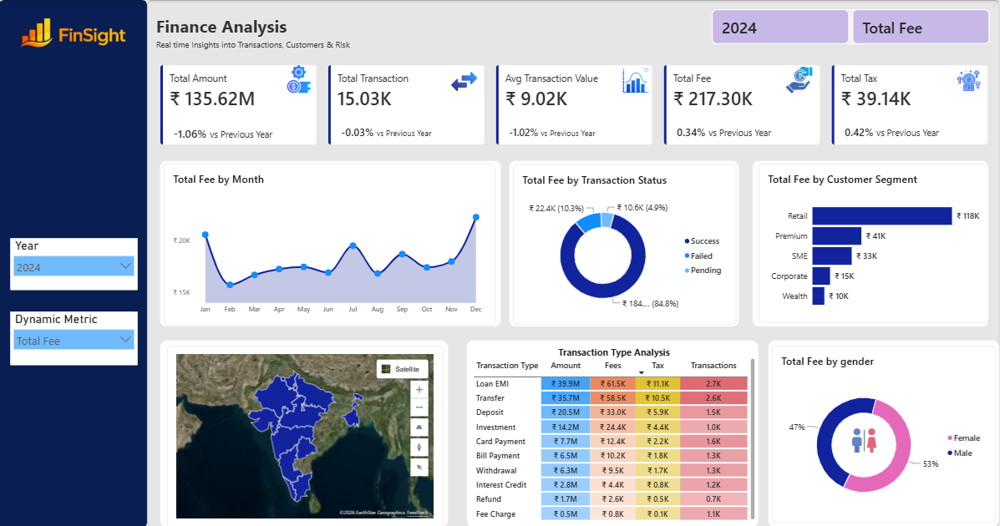

# Finance Analytics Dashboard

A comprehensive Power BI dashboard providing real-time insights into bank transactions, customer behavior, and risk analysis with year-on-year performance tracking.

**Enterprise-Level Banking Analytics** | Power BI | DAX | Data Modeling

---

## 📊 Dashboard Overview

This finance analytics project analyzes transactional data from a global banking institution, tracking key performance indicators including revenue, transaction volumes, fees, taxes, and customer risk profiles.

**Key Metrics:**
- **Total Revenue:** $24.9M
- **Total Transactions:** 25,200
- **Total Fees Collected:** Dynamic KPI
- **Tax Amount:** Dynamic KPI
- **Return Rate:** 2.2%

---

## 🎯 Features

### Overview Analysis Dashboard
- **5 Dynamic KPIs** with year-on-year growth comparison
- **Transaction Status Analysis** - Success/Failed/Pending breakdown
- **Customer Segmentation** - Retail, Premium, Corporate, Wealth segments
- **Geographic Analysis** - Performance by state and region
- **Transaction Type Heatmap** - Amount, fees, tax, and count analysis
- **Gender & Demographic Analysis** - Participation insights

### Transactions Detail Dashboard
- **Detailed Transaction Records** - Grid view with all transaction details
- **Drill-Through Functionality** - Explore underlying data by filters
- **Dynamic Filtering** - By customer, transaction type, status, location
- **Export Capability** - Download filtered data as CSV

---

## 📈 Key Visualizations

### Screenshot 1: Customer Analysis

Customer segmentation and demographic insights.

---

## 🛠️ Technologies & Techniques Used

### Data Tools
- **Power BI Desktop** - Dashboard design and visualization
- **Power Query** - ETL and data transformation
- **DAX (Data Analysis Expressions)** - Advanced calculations

### Data Modeling
- **Fact Tables** - Finance transactions (50,000+ records)
- **Dimension Tables** - Customer data (5,000+ records)
- **Relationships** - One-to-many relationship modeling
- **Calendar Table** - Time intelligence and date calculations

### Advanced Features
- **Year-on-Year Calculations** - Time intelligence functions
- **Same Period Last Year (SPLY)** - Year-over-year comparisons
- **Dynamic Measures** - Runtime metric switching
- **Drill-Through Reports** - Deep data exploration
- **Conditional Formatting** - Heat maps and color coding

---

## 📊 Data Structure

### Finance Transactions Table
- Transaction ID (Primary Key)
- Transaction Date
- Customer ID (Foreign Key)
- Account ID
- Transaction Type (Bill Payment, Transfer, Card Payment, etc.)
- Channel (ATM, Branch, Net Banking, Mobile)
- Merchant Category (Food, Entertainment, Healthcare, etc.)
- Amount
- Fee Amount
- Tax Amount
- Currency
- Transaction Status (Success, Failed, Pending)
- Fraud Flag
- Risk Score
- Reference Number

### Customers Table
- Customer ID (Primary Key)
- Customer Name
- Gender
- Date of Birth
- City
- State
- Occupation
- Customer Segment (Corporate, Premium, Retail, SMMES, Wealth)
- Annual Income
- Join Date

---

## 📚 Skills Demonstrated

✓ Power BI Dashboard Design  
✓ Data Cleaning & Transformation (Power Query)  
✓ Relational Data Modeling  
✓ Advanced DAX Formulas & Calculations  
✓ Time Intelligence Functions  
✓ Year-on-Year Analysis & Comparisons  
✓ KPI Tracking & Performance Metrics  
✓ Interactive Filtering & Slicing  
✓ Drill-Through & Detail Page Functionality  
✓ Financial Domain Knowledge  
✓ Data Visualization Best Practices  

---

## 📖 How to Use

### Installation
1. Download `Finance-Analytics-Dashboard.pbix`
2. Open in **Microsoft Power BI Desktop** (free download)
3. Refresh data connections when prompted
4. Allow data model to load

### Navigation
- **Year Slicer** - Switch between 2023, 2024, 2025, 2026
- **Dynamic Metric Selector** - Change metrics on-the-fly (Amount, Fees, Tax, etc.)
- **Drill-Through** - Click on any data point to explore underlying transactions
- **Filters** - Use occupational, categorical, and demographic filters
- **Export Data** - Right-click on visuals to export filtered data

### Key Insights to Explore
- **Revenue Trends** - Monthly patterns and seasonal spikes
- **Transaction Success Rate** - Identify failed transactions
- **Top Customers** - Revenue and order volume leaders
- **Geographic Performance** - State-wise and region-wise analysis
- **Risk Analysis** - Risk scores and fraud detection
- **Customer Segments** - Which segments generate most revenue

---

## 💼 Real-World Application

This dashboard is designed for:
- **Executive Teams** - High-level KPI monitoring
- **Financial Analysts** - Deep-dive transaction analysis
- **Risk Management** - Fraud and risk monitoring
- **Operations** - Transaction status and efficiency tracking
- **Business Development** - Customer and regional performance analysis

---

## 🎓 Learning Outcomes

This project demonstrates:
- Building enterprise-level business intelligence solutions
- Implementing complex data models with multiple tables
- Creating advanced time intelligence calculations
- Designing interactive dashboards for non-technical users
- Domain expertise in banking and finance
- Professional data visualization standards
